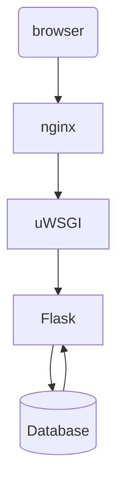
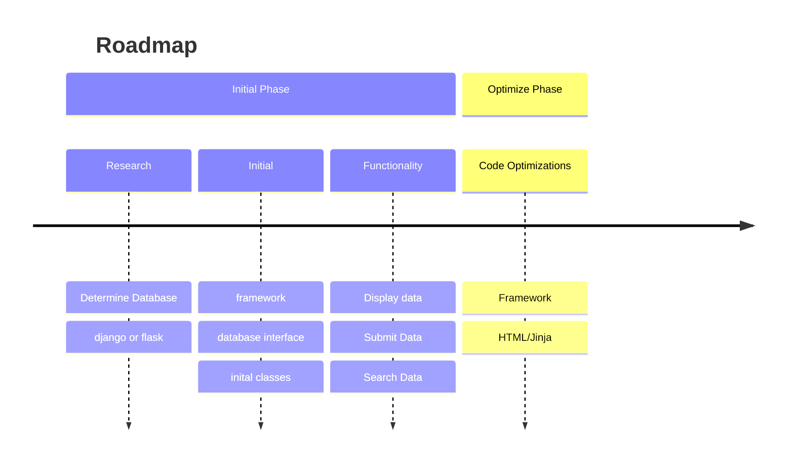

# book-memory

## Status: Draft

## Description

Designed because I accidently bought a book I started and
didn't like that I had already started listening to.

## Required Apps

Built on Python 3.13

Database (TBD)

## Installation

This is meant to run in a container, either docker or kubernetes.

## Configuration

Use .env/secrets/ect to set environment variables.

```bash
BOOKMEMORY_DB_SERVER=${BOOKMEMORY_DB_SERVER:-""} # empty string sqlite3
BOOKMEMORY_DB_USERNAME=${BOOKMEMORY_DB_USERNAME:-"bookkeeper"}
BOOKMEMORY_DB_PASSWORD=${BOOKMEMORY_DB_PASSWORD:-"placeholder"}
```

## Diagram



## Progress



## Notes

* Nothing to note yet
